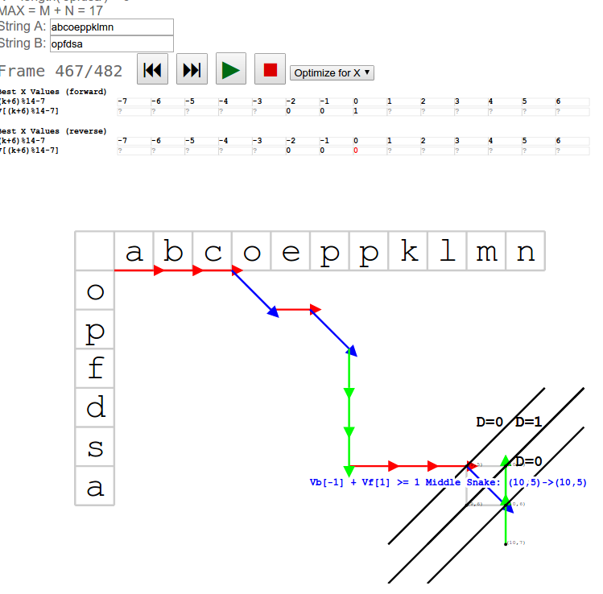

#  CONTRIBUTING

 DO NOT CREATE PULL REQUESTS FOR THIS PROJECT.  ANY PULL REQUESTS YOU CREATE WILL NOT BE MERGED IN. 

Contributing to this project is not currently permitted.

#  OVERVIEW

For an interactive demo and explanation, see http://blog.robertelder.org/diff-algorithm/

#  REPOSITORY CONTENTS

This repository contains Python implementations of multiple variations of algorithms discussed in the paper 'An O(ND) Difference Algorithm and Its Variations' by EUGENE W. MYERS.  See section DIFFUTILS PATCH for more details.

In addition to stand-alone algorithms, a proof-of-concept patch for GNU diffutils that is slower for most common use cases, but is asymptotically faster in calculating a minimal edit sequence when the files are of very different size.

Here is a listing of functions included in myers_diff_and_variations.py

-  diff(list1, list2)  - A function to determine the minimal difference between two sequences that
   is super easy to just copy and paste when you don't actually care about all the other stuff
   in this document, and you just need to get back to work because it's already 7pm and you're still
   at the office, and you just want to get this stupid thing to work, why is there no easy answer on
   Stack Overflow that I can just copy and paste?  Oh man, I really need to stop doing this and  
   start saying no to these crazy dealines.  I have so many friends that I need to get back to and haven't
   spoken to in a while...  Maybe I'll just stay until most of my stock options vest, and then I'll
   quit.  This function has worst-case execution time of O(min(len(a),len(b)) * D), and requires
   2 * (2 * min(len(a),len(b))) space.

-  apply_edit_script(edit_script, s1, s2) - An example function that shows how you could make use of
   the edit script returned by 'diff' or 'shortest_edit_script' by re-constructing s2 from s1 and the
   edit script.

-  shortest_edit_script(old_sequence, new_sequence) - A well-formatted version of the diff function
   (mentioned above) that optimizes for code clarity and readability.  This version also calls out
   to the find_middle_snake function which it depends on.  This version of the algorithm is also
   presented in a way that attempts to match the description from the paper.

-  longest_common_subsequence(list1, list2) - A function that returns a list that is the longest
   common sub-sequence of the two input sequences.

-  find_middle_snake_less_memory(old_sequence, N, new_sequence, M) - A variant of the 'find middle
   snake' algorithm that has more restricted bounds so the calculation doesn't go off end end of the
   edit grid.  It has worst-case execution time of min(len(a),len(b)) * D, and requires
   2 * (2 * min(len(a),len(b))) space.

-  find_middle_snake_myers_original(old_sequence, N, new_sequence, M) - A concrete implementation of
   the algorithm discussed in Myers' paper.  This algorithm has worst-case execution time of (M + N) * D
   and requires 2 * (M + N) space.

-  myers_diff_length_minab_memory(old_sequence, new_sequence) - A version of the basic length measuring 
   algorithm that makes use of the restricted bounds, and also allocates less memory by treating the V
   array as a circular buffer.

-  myers_diff_length_original_page_6(old_sequence, new_sequence) - A concrete implementation of the algorithm
   discussed on page 6 of Myers' paper.

-  myers_diff_length_optimize_y_variant(old_sequence, new_sequence) - A variant of the basic length measuring 
   algorithm that optimized for the y variable instead of x.  It is helpful to study this version when
   attempting to understand the algorithm since the choice of optimizing x or y is rather arbitrary.

-  Various other functions are included for testing.

See myers_diff_and_variations.py for more details.

#  LICENSE

For everything other than the diffutils patch, see LICENSE.txt
For the diffutils patch, see the license provided by diffutils: https://www.gnu.org/software/diffutils/

#  DIFFUTILS PATCH

This patch takes of a couple refinements of the Myers algorithm that are not mentioned in the paper.

The included diffutils patch was created based on a version of diffutils 3.6 that has the following sha256sum:

d621e8bdd4b573918c8145f7ae61817d1be9deb4c8d2328a65cea8e11d783bd6  diffutils-3.6.tar.xz
