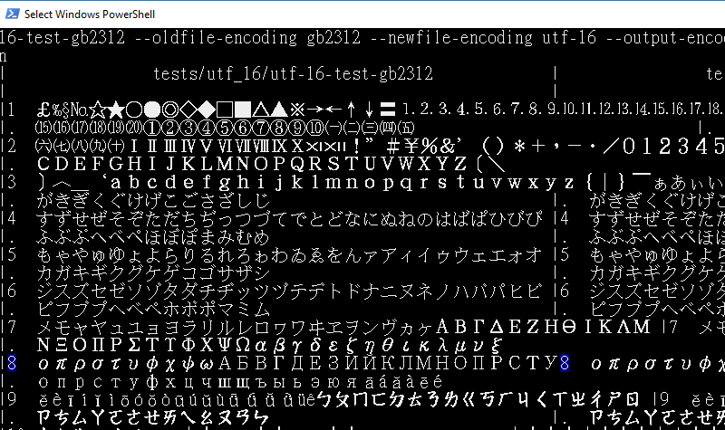
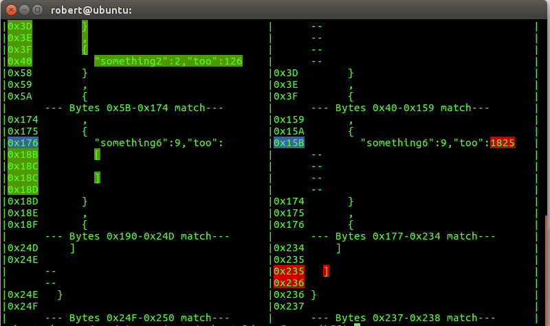
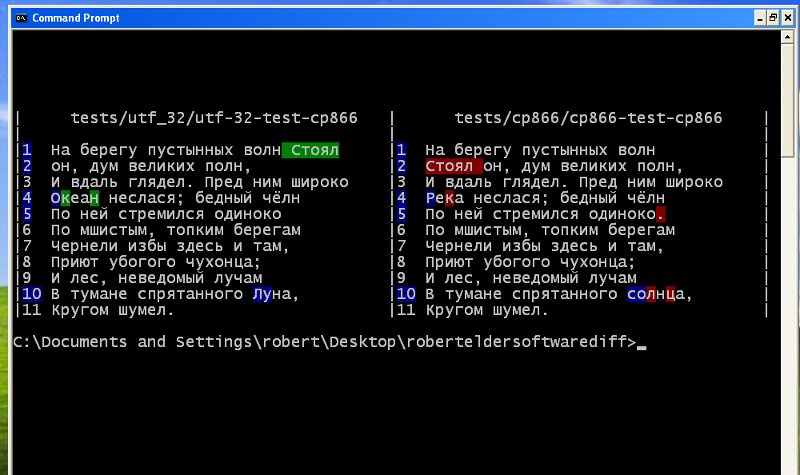
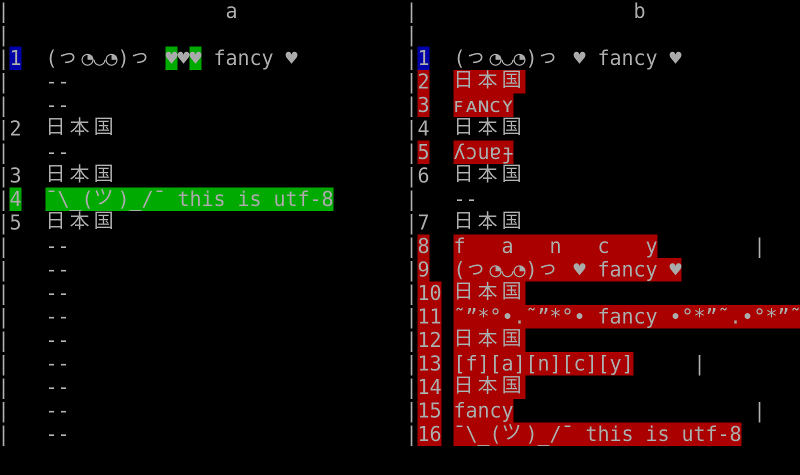
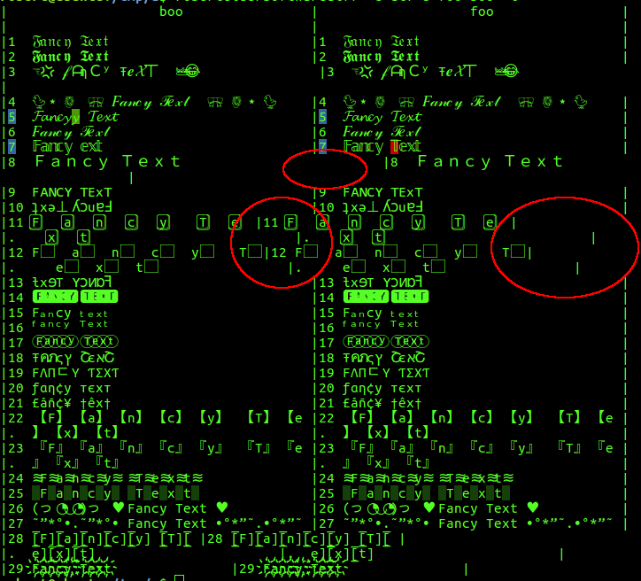

#  CONTRIBUTING

 DO NOT CREATE PULL REQUESTS FOR THIS PROJECT.  

 ANY PULL REQUESTS YOU CREATE WILL NOT BE MERGED IN. 

Contributing to this project is not currently permitted.

Having said this, don't let the warning above prevent you from filing issues if you find something broken or undesirable.

#  BEAUTIFUL TERMINAL DIFFS, EVERYWHERE

This repository contains several different bodies of work, including a terminal based diff tool:

-  roberteldersoftwarediff.py:  A terminal based diff tool with support for unicode and a few other encodings.

 | 
:-------------------------:|:-------------------------:
 | 

#  Myers Diff Algorithms

Also included are a number of variations of the Myers Diff Algorithm and related subsequence algorithms:

-  myers_diff_and_variations.py:  A collection of variants of the myers diff algorithm and associated algorithms.


-  diffutils-3.6-myers-optimization.patch:  An experimental path for Unix diffutils that is asymptotically faster for some large input sizes when calculating a minimal difference.  See also: http://blog.robertelder.org/diff-algorithm/


#  ROBERTELDERSOFTWAREDIFF.PY

Also see [Terminal Diff Tool Documentation](http://blog.robertelder.org/terminal-diff-tool/)

'roberteldersoftwarediff' is a light-weight minimal-dependency terminal-based diff tool that is implemented in a single python file.  Its only dependences are implemented in the python standard library.  It works with python 2.7 and python 3.6.

By default it does not differentiate between text and binary data, but you can optionally specify each input file encoding separately to generate a diff that is encoding aware.  In addition, you can also change the output encoding.  NOTE:  Unicode output only works correctly in cases where the font and environment settings are correct:  The correct code page must be active, and the current font must be capable of displaying the relevant characters.

A primary objective of roberteldersoftwarediff.py is robustness and correctness (as opposed to speed).  It should not crash under any circumstance, and if you find such a case, feel free to file an issue.  Here are a few additional features:

-  Works with python 2.7 and python 3.6.
-  Works on Windows and Linux.
-  Works in various Linux shells.
-  Works on Windows XP, Windows 7, Windows 10.
-  Works in various versions of Powershell, colour support missing from Powershell ISE.
-  Works in cmd.exe, Cygwin, bash on windows, putty.
-  Works in various terminal emulators on Linux.
-  Works in Linux VT console (fbterm is required for Asian character support due to limitations of Linux console environment).

#  WHY WOULD YOU EVER WANT TO USE THIS?

-  To diff minified css/json/javascript.
-  Mixed encoding diffs:  Diff a UTF-32 encoded file with big5hkscs encoded text, then output the result in UTF-8.
-  Quickly check for tiny binary and text differences in mixed ASCII/binary content.
-  To diff minified html.
-  The diffs look better than those in of vimdiff in many cases.
-  Works in many different terminal environments on Linux and Windows.
-  Better support for Unicode (and other encodings) than Unix diff.
-  No external dependencies other than Python standard library; works in Python 2.7 and Python 3.6.
-  Packed into a single portable file.

#  WHAT ARE GOOD REASONS NOT TO USE THIS?

-  For large files that have many differences, the current comparison algorithm is asymptotically much slower then Unix diff.  I can fix this, but I don't plan to work on it unless I see a couple people filing issues about it first.
-  It's relatively new and it might contain lots of bugs.
-  This tool emphasizes being able to diff *any* type of file (binary files, files with different encodings, diffs between encodings) in any terminal context on multiple platforms and environments.  If you're looking for a diff tool that is specifically optimized for presenting diffs of your source code changes, this probably isn't the best tool on the market right now, but it will still work.

#  ROBERTELDERSOFTWAREDIFF.PY WINDOWS INSTALL NOTES

There isn't really anything to install, but you will need to make sure that Python is installed on your system first.  Then, just take the 'roberteldersoftwarediff.py' file and put it wherever you want, then run it like this on Windows:

```
C:\Python27\python.exe C:\Put The Path To roberteldersoftwarediff Here\roberteldersoftwarediff.py file1 file2
```

Note that 'C:\Python27\python.exe' above should be replaced with whatever the actual location of your python installation is, and 'Put The Path To The File Here' should be the location of your 'roberteldersoftwarediff.py' file.

Typing out the 'C:\Python27\' and 'C:\Put The Path To roberteldersoftwarediff Here\' part over and over again is annoying, and you can change it so you don't need to type this by setting the environment variables of your terminal so that it knows the location of Python and of roberteldersoftwarediff.py. Then, you'll only have to type this:

```
python roberteldersoftwarediff.py file1 file2
```

Or even simply this:

```
roberteldersoftwarediff.py file1 file2
```

To get the last one to work, you'll need to make sure that '.py' files are associated with Python.exe.  You can do thing using the familiar right-click on file, and 'Open With...' option and select 'Always open files of this type with this Application'.

You can temporarily set the path variable in cmd.exe so it can locate python like this:

```
set PATH=%PATH%;C:\Python27
```

Once again, note that the 'Python27' has to *actually* be the path of your python installation.

If you put your 'roberteldersoftwarediff.py' file on the desktop in Windows XP, you could then set its path variable like this:

```
set PATH=%PATH%;C:\"Document and Settings"\robert\Desktop
```

Here is a link that might help you figure all this out:

[Running Python Script From Windows Command Line](https://stackoverflow.com/questions/4621255/how-do-i-run-a-python-program-in-the-command-prompt-in-windows-7)

If you want to set your path variables permanently, you can explore other options:

[How to persistently set path in cmd.exe](https://stackoverflow.com/questions/5898131/set-a-persistent-environment-variable-from-cmd-exe)
[How to persistently set path in Powershell](https://stackoverflow.com/questions/714877/setting-windows-powershell-path-variable)

In order for unicode characters to display properly in Windows terminals, you will need to first change the currently active code page to one that supports the characters you want to display.  For example, to set the active code page to one that is similar to UTF-8, use:

```
chcp 65001
```

You can use

```
chcp
```

by itself to see what the currently active code page is.  By default it is usually 437, which displays a very limited number of characters.

In addition, you will need to set the console font to one that can display these exotic characters. I have found 'Lucida Console' to be a fairly good chose that is available on most platforms.  Keep in mind that printing unicode characters is not well supported in general in Windows terminals, and I have encountered a number of rendering bugs on Windows that appear to be out of my control.

Finally, depending on your version of Windows, you may need to install additional language packs or change your location or language settings in the control panel in order to actually see all of the various exotic language characters in your terminal.


#  ROBERTELDERSOFTWAREDIFF.PY UNIX NOTES

Once again, there isn't much to install here.  Just make sure Python is already installed on your system, and that your path variables are set correctly.

You can also just take the lazy way and add a symlink directly to 'roberteldersoftwarediff.py'

```
sudo ln -s /path/to/wherever/roberteldersoftwarediff.py /usr/local/bin/roberteldersoftwarediff
```

Now you should be able to run

```
roberteldersoftwarediff --version
```

And see some version information.

If you plan to use this tool in a standard terminal emulator in an X environment, you can ignore the next section.

If you want to get the display of unicode characters to work Unix console (VT  other than 7) on Ubuntu, you may want to explore some of these commands for setting fonts, font sizes, and installing languages packages:

```
#  Used to configure font sizes and character sets
sudo dpkg-reconfigure console-setup
#  Install support for specific language (french in this case):
sudo apt-get -y install `check-language-support -l fr`
#  Generate locales
sudo dpkg-reconfigure locales
```

By default, the Linux console is not capable of displaying the large number of glyphs needed to support Asian characters and various icons.  If you want to display these, you can do so using a framebuffer terminal emulator called 'fbterm':

```
sudo apt-get install fbterm
```

Then run 'fbterm' to change the console into a mode that can now display unicode characters.  You can check the man page for 'fbterm' which documents a number of options for changing things like the font size.

##  Scrolling Up And Down

It is likely that you'll want to be able to scroll up and down to look at the result of the diff like you would using vim diff.  You can accomplish the same thing by piping the result into 'less' with the -R flag to render the ANSI colour sequences:

```
roberteldersoftwarediff a.txt b.txt | less -R
```

#  ROBERTELDERSOFTWAREDIFF.PY COMMAND LINE ARGUMENTS

## Mandatory Positional Arguments:

##  oldfile

File name of old version.

##  newfile

File name of new version.

###### Example
```
roberteldersoftwarediff a.txt b.txt
```

## Optional Arguments:

##  -h, --help

Show a help message and exits.

###### Example
```
roberteldersoftwarediff -h
```

##  -i, --infinite-context

Showing infinite context before and after edits. This is often useful if you want to quickly see a hex dump of a file by diffing it with itself, and then using -i to see the entire context since there are no differences.

###### Example
```
roberteldersoftwarediff a.txt b.txt -i
```

##  -t LINES_CONTEXT, --lines-context LINES_CONTEXT

Number of lines of context to display before and after.

###### Example
```
roberteldersoftwarediff a.txt b.txt -t 5
```


##  -w MAX_LINE_LENGTH, --max-line-length MAX_LINE_LENGTH

Chop up lines as if they were multiple lines when they exceed N characters.  Note that you will probably want to set --delimiters to be an empty array if you use this option, otherwise lines will also be split up using the default delimiter too.

###### Example
```
roberteldersoftwarediff a.txt b.txt --delimiters -w 20 
```

##  --oldfile-message OLDFILE_MESSAGE

Message to display over old file.

###### Example
```
roberteldersoftwarediff a.txt b.txt --oldfile-message "This is the old version."
```


##  --newfile-message NEWFILE_MESSAGE

Message to display over new file.

###### Example
```
roberteldersoftwarediff a.txt b.txt --newfile-message "This is the new version."
```


##  --disable-header      

Disable header that labels the two files using oldfile message and newfile message.

###### Example
```
roberteldersoftwarediff a.txt b.txt --disable-header
```


##  --enable-ansi         

Explicitly attempt to disable ANSI color control sequences.

###### Example
```
roberteldersoftwarediff a.txt b.txt --enable-ansi
```


##  --disable-ansi        

Explicitly attempt to enable ANSI color control sequences.

###### Example
```
roberteldersoftwarediff a.txt b.txt --disable-ansi
```

##  --enable-windows-terminal-colours

Explicitly attempt to enable Windows colour setting calls.

###### Example
```
roberteldersoftwarediff a.txt b.txt --enable-windows-terminal-colours
```


##  --disable-windows-terminal-colours

Explicitly attempt to disable Windows colour setting calls.

###### Example
```
roberteldersoftwarediff a.txt b.txt --disable-windows-terminal-colours
```

##  --enable-mark         

Enable a marking symbols on the left-hand side that displays a check mark mark or x.


###### Example
```
roberteldersoftwarediff a.txt b.txt --enable-mark
```

##  --disable-line-numbers

Disable line numbers.

###### Example
```
roberteldersoftwarediff a.txt b.txt --disable-line-numbers
```


##  --disable-colours     

Disable any form of colour output.

###### Example
```
roberteldersoftwarediff a.txt b.txt --disable-colours
```

##   -k, --include-delimiters

Include delimiters in the diff

###### Example
```
roberteldersoftwarediff a.csv b.csv --delimiters "\n" "," -k
```

##  --show-byte-offsets   

Show byte offsets instead of line numbers.

###### Example
```
roberteldersoftwarediff a.txt b.txt --show-byte-offsets   
```


##  -d [DELIMITERS [DELIMITERS ...]], --delimiters [DELIMITERS [DELIMITERS ...]]

An optional list of delimiters to use in deciding when to split lines. By default if Windows is detected --delimiters will be "\r\n". If Linux is detected --delimiters will be "\n". If the platform detection isn't working properly, or if you want to diff a file from another platform, you can explicitly specify the line delimiters. If you specify --delimiters with nothing after it, this means that lines will never be split based on any character.


###### Example
```
roberteldersoftwarediff a.txt b.txt --delimiters "Hi There" "\n" ";"
```

##  -p [PUSH_DELIMITERS [PUSH_DELIMITERS ...]], --push-delimiters [PUSH_DELIMITERS [PUSH_DELIMITERS ...]]

Special delimiters used to indicate the start of a new line that should be intended.

###### Example
```
roberteldersoftwarediff a.c b.c --push-delimiters "(" "{" --pop-delimiters ")" "}"
```

##  -q [POP_DELIMITERS [POP_DELIMITERS ...]], --pop-delimiters [POP_DELIMITERS [POP_DELIMITERS ...]]

Special delimiters used to indicate the end of a line should have been intended.

###### Example
```
roberteldersoftwarediff a.c b.c --push-delimiters "(" "{" --pop-delimiters ")" "}"
```

##  -r PARAMETERS_ENCODING, --parameters-encoding PARAMETERS_ENCODING

The encoding to use when processing command-line parameters.
###### Example
```
roberteldersoftwarediff a.txt b.txt --parameters-encoding utf-8 --oldfile-message "日本国"  --output-encoding utf-8
```

##  -o OUTPUT_ENCODING, --output-encoding OUTPUT_ENCODING

The encoding of the output.

###### Example
```
roberteldersoftwarediff a.txt b.txt --parameters-encoding utf-8 --oldfile-message "日本国"  --output-encoding utf-8
```


##  -a OLDFILE_ENCODING, --oldfile-encoding OLDFILE_ENCODING

The encoding of oldfile.

###### Example
```
roberteldersoftwarediff a.txt b.txt --oldfile-encoding utf-8 --newfile-encoding big5hkscs --output-encoding utf-8
```

##  -b NEWFILE_ENCODING, --newfile-encoding NEWFILE_ENCODING

The encoding of newfile.

###### Example
```
roberteldersoftwarediff a.txt b.txt --oldfile-encoding utf-8 --newfile-encoding big5hkscs --output-encoding utf-8
```

##  -f OUTFILE, --outfile OUTFILE

Output to the specified file instead of stdout

###### Example
```
roberteldersoftwarediff a.txt b.txt --outfile results
```

##  --newline NEWLINE     

Optionally choose what character(s) to use when printing a new line of output. This is useful in some context where printing either "\n" or "\r\n" will result in extra blank lines. In some context, you may need to use --newline "" to avoid extra blank lines in the output.

###### Example
```
roberteldersoftwarediff a.txt b.txt --newline "\r\n"
```


##  -v, --verbose         

Be verbose.

###### Example
```
roberteldersoftwarediff a.txt b.txt --verbose
```

##  -e E                  

Set the encoding of oldfile, newfile, output, and parameters at the same time

###### Example
```
roberteldersoftwarediff a.txt b.txt -e utf-8
```

##  -m M                  

Equivalent to explicitly adding flags of the form: --push-delimiters PUSH_DELIMS --pop-delimiters POP_DELIMS --include-delimiters. For -m json, -m css, or -m js, PUSH_DELIMS, POP_DELIMS = "(" "{" "[", ")" "}" "]". For -m html: "(" "{" "[" "<", ")" "}" "]" ">".

###### Example
```
roberteldersoftwarediff a.html b.html -m html
roberteldersoftwarediff a.json b.json -m json
roberteldersoftwarediff a.js b.js -m js
roberteldersoftwarediff a.css b.css  -m css
```


##  -x X                  

Display all bytes of the file in a pseudo-hex editor like format. Requires an integer argument to know how many bytes to display on each line. All output will be in standard ASCII. Equivalent to setting adding the following flags: --delimiters --show-byte-offsets --max-line. If you also explicitly set the output encoding will turn off hex encoding of characters.

###### Example
```
roberteldersoftwarediff a.out b.out -x 16
```


##  --version

Show program's version number and exit

###### Example
```
roberteldersoftwarediff --version
```

#  UNICODE ALIGNMENT ISSUES

The most obvious case where this tool will look like its broken is in calculating the layout when attempting to display various exotic unicode characters (especially Asian).  In these cases, characters do not take up a single terminal column, (even with a monospaced font!) and this presents a great problem in calculating the layout to print because the exact width of the characters cannot be accurately determined in general.  Great pains have been taken to make this as accurate as possible, but even things like changing the current font can change how many columns wide a character is.  I have spent enough time attempting to develop work-arounds to this problem that I'm tempted to declare that it is not only an open problem, but an *impossible* problem.




#  OTHER CAVEATS

There are so many issues that can occur when printing unicode (and other character encodings) in terminal that it is an insurmountable task to document all of them.  Here are a few things to think about if you're not seeing characters display properly in the order of likely importance:

-  Check to make sure you're actually have a compatible code page, or character encoding set.  In windows terminal, this is done with the 'chcp' command.  In something like gnome-terminal, this will be located in your preferences.  For Linux console on Ubuntu, something like 'sudo dpkg-reconfigure console-setup' might help you.
-  Check to make sure you have a font that can actually render the characters active.
-  Check to make sure your locale is set to something that requires international characters (especially on Windows).
-  Make sure you have the various pieces of internationalization software that your OS needs to display these characters.  These are often omitted by default because they take up a lot of space.  Go into your OS's language and internationalization settings and try checking some check boxes, or setting the locale to one that requires the characters you want to display.
-  If you attempt to diff two files while specifying an encoding, but each file has a different invalid character in it, but is otherwise the same, the two different characters will be discarded, and the diff will detect no difference.  This occurs because the invalid characters are ignored and excluded from the diff.  If you have such a case, you should diff in binary mode to see the differences.
-  The Linux VT Console only has support for a limited number of glyphs, although you can use 'fbterm' from the console which allows you display many more characters.
-  Due to limitation of Python 2.7, it seems like there are some cases where unicode conversion errors do not properly call the 'ignore' callback handler, thus leading to encoding errors which are not detected and therefore not reported.

#  MYERS DIFF ALGORITHM VARIANTS

For an interactive demo and explanation, see http://blog.robertelder.org/diff-algorithm/

This repository contains Python implementations of multiple variations of algorithms discussed in the paper 'An O(ND) Difference Algorithm and Its Variations' by EUGENE W. MYERS.  See section DIFFUTILS PATCH for more details.

In addition to stand-alone algorithms, a proof-of-concept patch for GNU diffutils that is slower for most common use cases, but is asymptotically faster in calculating a minimal edit sequence when the files are of very different size.

Here is a listing of functions included in myers_diff_and_variations.py

-  diff(list1, list2)  - A function to determine the minimal difference between two sequences that
   is super easy to just copy and paste when you don't actually care about all the other stuff
   in this document, and you just need to get back to work because it's already 7pm and you're still
   at the office, and you just want to get this stupid thing to work, why is there no easy answer on
   Stack Overflow that I can just copy and paste?  Oh man, I really need to stop doing this and  
   start saying no to these crazy deadlines.  I have so many friends that I need to get back to and haven't
   spoken to in a while...  Maybe I'll just stay until most of my stock options vest, and then I'll
   quit.  This function has worst-case execution time of O(min(len(a),len(b)) * D), and requires
   2 * (2 * min(len(a),len(b))) space.

-  apply_edit_script(edit_script, s1, s2) - An example function that shows how you could make use of
   the edit script returned by 'diff' or 'shortest_edit_script' by re-constructing s2 from s1 and the
   edit script.

-  shortest_edit_script(old_sequence, new_sequence) - A well-formatted version of the diff function
   (mentioned above) that optimizes for code clarity and readability.  This version also calls out
   to the find_middle_snake function which it depends on.  This version of the algorithm is also
   presented in a way that attempts to match the description from the paper.

-  longest_common_subsequence(list1, list2) - A function that returns a list that is the longest
   common sub-sequence of the two input sequences.

-  find_middle_snake_less_memory(old_sequence, N, new_sequence, M) - A variant of the 'find middle
   snake' algorithm that has more restricted bounds so the calculation doesn't go off end end of the
   edit grid.  It has worst-case execution time of min(len(a),len(b)) * D, and requires
   2 * (2 * min(len(a),len(b))) space.

-  find_middle_snake_myers_original(old_sequence, N, new_sequence, M) - A concrete implementation of
   the algorithm discussed in Myers' paper.  This algorithm has worst-case execution time of (M + N) * D
   and requires 2 * (M + N) space.

-  myers_diff_length_minab_memory(old_sequence, new_sequence) - A version of the basic length measuring 
   algorithm that makes use of the restricted bounds, and also allocates less memory by treating the V
   array as a circular buffer.

-  myers_diff_length_original_page_6(old_sequence, new_sequence) - A concrete implementation of the algorithm
   discussed on page 6 of Myers' paper.

-  myers_diff_length_optimize_y_variant(old_sequence, new_sequence) - A variant of the basic length measuring 
   algorithm that optimized for the y variable instead of x.  It is helpful to study this version when
   attempting to understand the algorithm since the choice of optimizing x or y is rather arbitrary.

-  Various other functions are included for testing.

See myers_diff_and_variations.py for more details.

#  LICENSE

For everything other than the diffutils patch, see LICENSE.txt
For the diffutils patch, see the license provided by diffutils: https://www.gnu.org/software/diffutils/

#  DIFFUTILS PATCH

This patch takes of a couple refinements of the Myers algorithm that are not mentioned in the paper.

The included diffutils patch was created based on a version of diffutils 3.6 that has the following sha256sum:

d621e8bdd4b573918c8145f7ae61817d1be9deb4c8d2328a65cea8e11d783bd6  diffutils-3.6.tar.xz

